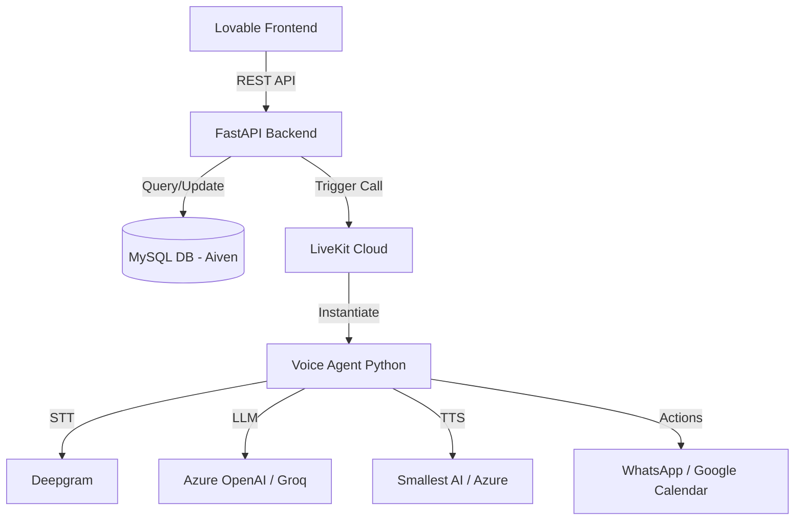

# Knowledge Transfer (KT) Guide: Hookfish Voice Agent & Dashboard

This document provides a comprehensive walkthrough of the Hookfish AI cold-calling platform, including code structure, external integrations, and setup instructions.

---

## 1. Project Overview
Hookfish is an AI-powered voice agent platform designed for real estate (buyers and brokers). It consists of:
- **Voice Agent**: A low-latency conversational AI built on LiveKit.
- **Dashboard API**: A FastAPI backend providing data for the management UI.
- **UI**: A React/Lovable frontend for monitoring and campaign management.

---

## 2. System Architecture



---

## 3. Code Walkthrough

### Core Backend (`/api`)
- **`main.py`**: Entry point. Configures FastAPI, CORS, and registers routes.
- **`routes/`**:
    - `campaigns.py`: Manages batch call lists.
    - `contacts.py`: Lead management.
    - `dashboard.py`: Analytics and summary data.
    - `monitor.py`: Real-time call tracking.
- **`auth.py`**: JWT-based authentication logic.

### Voice Agent (`voice_agent.py`)
- The "Brain" of the call.
- Uses **LiveKit Agents SDK**.
- Handles VAD (Voice Activity Detection), STT, LLM streaming, and TTS synthesis.
- Includes logic for:
    - **Hinglish** support (via specific TTS models).
    - **Interruption** handling.
    - **Function Calling**: Scheduling meetings (Google Calendar) and sending summaries (WhatsApp).

### Integration Helpers
- **`db_helper.py`**: All SQL interactions. Optimized for high-concurrency voice sessions.
- **`whatsapp_helper.py`**: Integrates with Meta Cloud API to send follow-up templates.
- **`google_calendar.py`**: Manages OAuth and event creation for scheduling.

---

## 4. External Services & Credentials
The project relies on several specialized providers. All credentials should be in the `.env` file.

| Service | Purpose | Provider |
| :--- | :--- | :--- |
| **LiveKit** | Real-time audio transport | LiveKit Cloud |
| **LLM** | Conversational Intelligence | Azure OpenAI (GPT-4o) |
| **STT** | Voice to Text | Deepgram |
| **TTS** | Text to Voice (Hinglish) | Smallest AI / Azure Speech |
| **Database** | Persistence | Aiven MySQL |
| **WhatsApp** | Follow-up notifications | Meta Cloud API |
| **Telephony** | SIP Trunks / Phone Numbers | Vobiz |

---

## 5. Setup & Installation

### Prerequisites
- Python 3.10+
- LiveKit CLI (for local testing)
- MySQL client

### Installation
1. **Clone the repository.**
2. **Create a virtual environment**:
   ```bash
   python -m venv venv
   source venv/bin/activate  # or venv\Scripts\activate on Windows
   ```
3. **Install dependencies**:
   ```bash
   pip install -r requirements.txt
   ```
4. **Configure Environment**:
   Copy `.env.example` to `.env` and fill in the credentials.

---

## 6. Testing Steps

### Unit Testing Services
Before running a full call, verify individual services:
- **Database**: `python test_db_connection.py`
- **TTS**: `python test_smallest_tts.py`
- **LLM**: `python test_groq.py`
- **WhatsApp**: `python whatsapp_helper.py` (has built-in test case)

---

## 7. UI Integration
The UI communicates with the backend via the `/api` endpoints.
- **Base URL**: Set in the frontend env as `VITE_API_URL`.
- **Auth**: The frontend stores the JWT token returned by `/api/auth/login`.
- **Integration**: When you "Start Campaign" in the UI, it hits `/api/routes/campaigns.py` which then triggers the background call process.

---

## 8. Q&A / Support
- **Latency**: If response times are high, check the `AZURE_OPENAI_REGION` (Sweden Central is currently fastest).
- **Voice Quality**: Switch between `smallest_ai` and `azure` in `voice_agent.py` settings for different tonalities.
- **Logs**: Monitor console output of `voice_agent.py` for real-time debugging of the conversation flow.
