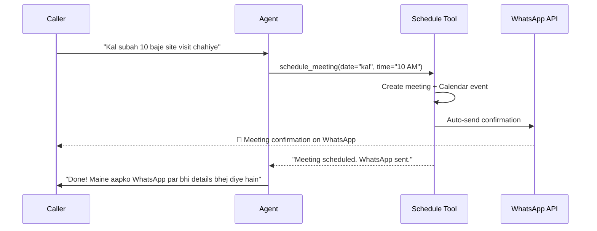
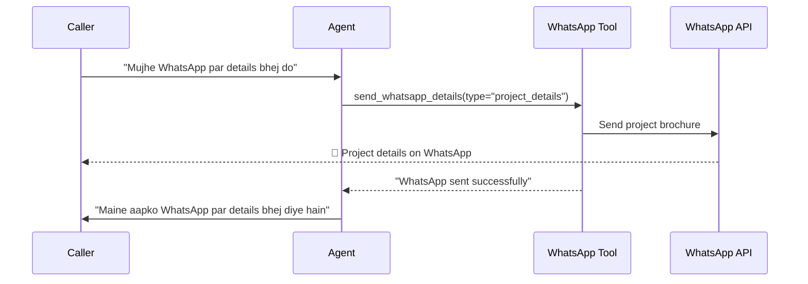

# 📱 WhatsApp Business API Integration — Setup Guide

## What Was Built

The WhatsApp integration sends **meeting/site visit confirmations** and **project details** automatically via WhatsApp when:

1. **A meeting is scheduled** → Auto-sends a beautifully formatted meeting confirmation
2. **The contact says "WhatsApp kar do"** → Agent uses the [send_whatsapp_details](file:///c:/Users/eshaa/OneDrive/Desktop/hookfish%20voice%20agent/voice_agent.py#952-1031) tool to send project brochure info
3. **Reminders** → A [send_schedule_reminder()](file:///c:/Users/eshaa/OneDrive/Desktop/hookfish%20voice%20agent/whatsapp_helper.py#518-609) function is available for scheduled reminders (can be triggered via a cron job)

---

## Files Modified/Created

| File | Change |
|------|--------|
| [whatsapp_helper.py](file:///c:/Users/eshaa/OneDrive/Desktop/hookfish%20voice%20agent/whatsapp_helper.py) | **NEW** — Complete WhatsApp Cloud API integration |
| [voice_agent.py](file:///c:/Users/eshaa/OneDrive/Desktop/hookfish%20voice%20agent/voice_agent.py) | Added [send_whatsapp_details](file:///c:/Users/eshaa/OneDrive/Desktop/hookfish%20voice%20agent/voice_agent.py#952-1031) tool + auto-WhatsApp on meeting schedule |
| [create_agent_tables.py](file:///c:/Users/eshaa/OneDrive/Desktop/hookfish%20voice%20agent/create_agent_tables.py) | Added `agent_whatsapp_logs` table |
| [.env](file:///c:/Users/eshaa/OneDrive/Desktop/hookfish%20voice%20agent/.env) | Added WhatsApp config placeholders |

---

## 🔧 Setup Steps (One-Time)

### Step 1: Create Meta Developer Account
1. Go to [https://developers.facebook.com](https://developers.facebook.com)
2. Create a **Business App**
3. Add the **WhatsApp** product to your app

### Step 2: Get API Credentials
1. In your app dashboard, go to **WhatsApp > API Setup**
2. Copy the **Phone Number ID** (not the phone number itself)
3. Copy the **Temporary Access Token** (for testing)
4. For production, create a **System User** and generate a **Permanent Token**

### Step 3: Update [.env](file:///c:/Users/eshaa/OneDrive/Desktop/hookfish%20voice%20agent/.env)
```env
WHATSAPP_PHONE_NUMBER_ID=123456789012345
WHATSAPP_TOKEN=EAAxxxxxxxxxxxxxxxxxxxxxxxxxxxxxxx
WHATSAPP_BUSINESS_NAME=Hookfish
```

### Step 4: Create Message Templates (Recommended)
In the **WhatsApp Manager** ([business.facebook.com](https://business.facebook.com)):

#### Template 1: [meeting_confirmation](file:///c:/Users/eshaa/OneDrive/Desktop/hookfish%20voice%20agent/whatsapp_helper.py#275-406)
- **Category:** Utility
- **Language:** English
- **Body:**
  ```
  Hello {{1}}! Your {{2}} has been confirmed.
  
  📅 Schedule: {{3}}
  🏗️ Project: {{4}}
  📍 Location: {{5}}
  👤 Contact: {{6}}
  
  For any changes, please reply or call us.
  ```

#### Template 2: [project_details](file:///c:/Users/eshaa/OneDrive/Desktop/hookfish%20voice%20agent/whatsapp_helper.py#408-516)
- **Category:** Marketing
- **Language:** English
- **Body:**
  ```
  Hello {{1}}! Here are the details for {{2}}.
  
  📍 Location: {{3}}
  💰 Price: {{4}}
  
  Reply for more info or to schedule a site visit!
  ```

#### Template 3: `meeting_reminder` (Optional)
- **Category:** Utility
- **Language:** English
- **Body:**
  ```
  Hi {{1}}! Reminder about your upcoming {{2}}.
  
  📅 Schedule: {{3}}
  🏗️ Project: {{4}}
  
  Looking forward to seeing you!
  ```

> [!NOTE]
> Templates need to be **approved by Meta** before they can be used. This usually takes a few hours. In the meantime, the system falls back to free-form text messages (which work within the 24-hour messaging window).

### Step 5: Add a Test Phone Number
In **WhatsApp > API Setup**, add your test phone number to receive messages during development.

---

## How It Works

### Flow 1: Auto-Send on Meeting Schedule


### Flow 2: On-Demand "Send Me Details"


---

## Database: `agent_whatsapp_logs`

All WhatsApp messages are tracked in the database:

| Column | Description |
|--------|-------------|
| [id](file:///c:/Users/eshaa/OneDrive/Desktop/hookfish%20voice%20agent/voice_agent.py#438-462) | UUID primary key |
| `phone_number` | Recipient's phone |
| `message_type` | [meeting_confirmation](file:///c:/Users/eshaa/OneDrive/Desktop/hookfish%20voice%20agent/whatsapp_helper.py#275-406), [project_details](file:///c:/Users/eshaa/OneDrive/Desktop/hookfish%20voice%20agent/whatsapp_helper.py#408-516), [reminder](file:///c:/Users/eshaa/OneDrive/Desktop/hookfish%20voice%20agent/whatsapp_helper.py#518-609) |
| `template_name` | WhatsApp template used (if any) |
| `whatsapp_message_id` | WhatsApp's message ID for tracking delivery |
| [status](file:///c:/Users/eshaa/OneDrive/Desktop/hookfish%20voice%20agent/db_helper.py#158-180) | `sent`, `delivered`, `read`, `failed` |
| `meeting_id` | Links to `agent_meetings` table |
| `call_log_id` | Links to `agent_call_logs` table |

---

## Testing

To test without the full voice agent, you can import and call the functions directly:

```python
from whatsapp_helper import send_meeting_confirmation, send_project_details

# Test meeting confirmation
result = send_meeting_confirmation(
    to_phone="+919876543210",
    contact_name="Rajesh Kumar",
    meeting_type="site_visit",
    meeting_date="5 April 2026",
    meeting_time="10:00 AM",
    project_name="Manikya",
    location="Mahim West, Mumbai",
    manager_name="Amit Sharma",
)
print(result)
```

> [!IMPORTANT]
> You **must** set `WHATSAPP_PHONE_NUMBER_ID` and `WHATSAPP_TOKEN` in your [.env](file:///c:/Users/eshaa/OneDrive/Desktop/hookfish%20voice%20agent/.env) file before testing. Without these, WhatsApp messages will fail gracefully (meeting is still saved in DB).
